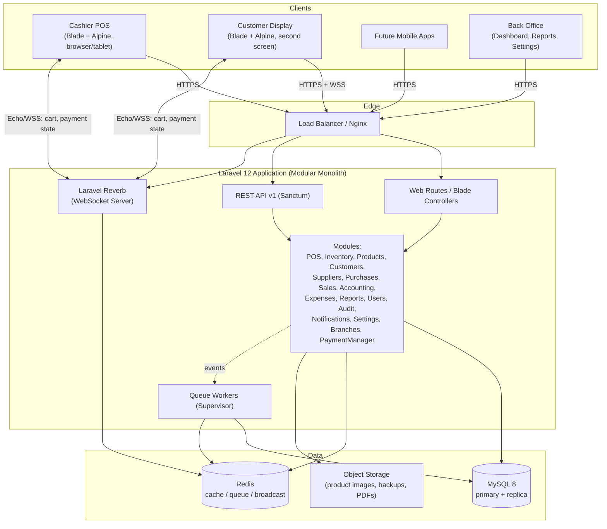
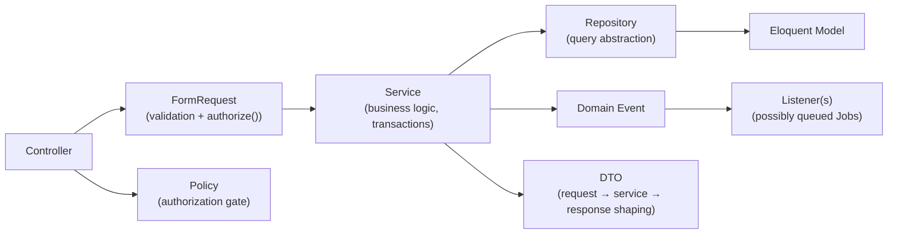
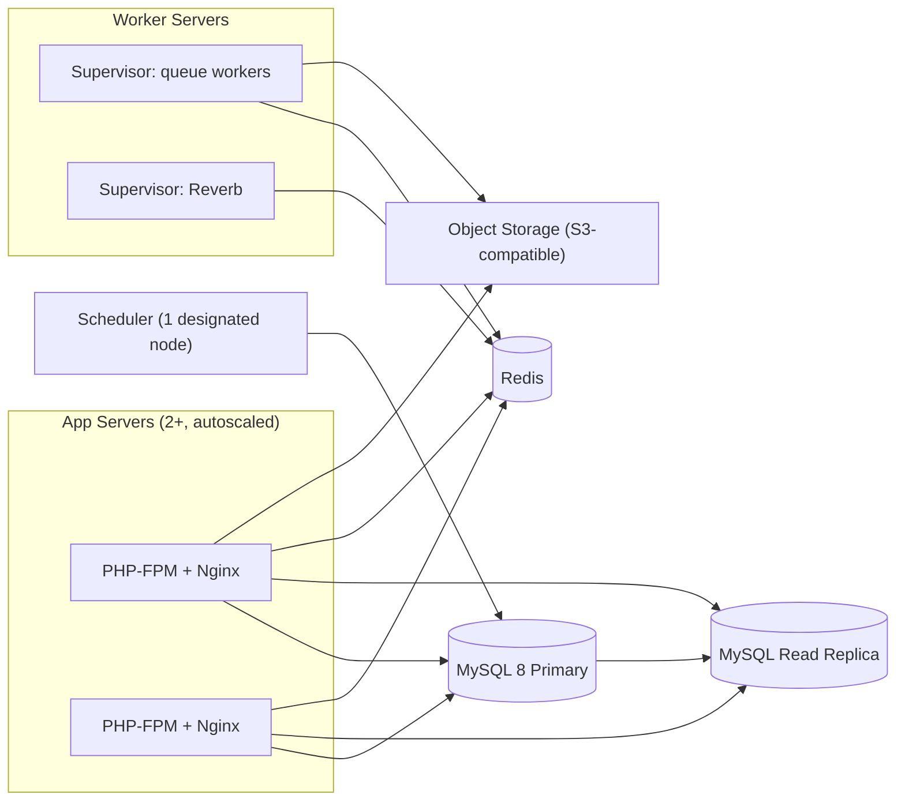

# 1. System Architecture

## 1.1 Style: Modular Monolith, Multi-Tenant SaaS

A single Laravel 12 codebase, deployed as one application, internally partitioned into
independent **modules** (via `nwidart/laravel-modules`). Each module owns its own models,
migrations, services, repositories, HTTP layer, events, policies, and routes, and communicates
with other modules only through:

- **Public service interfaces** (bound in each module's service provider), or
- **Domain events** (fire-and-forget, consumed by listeners in other modules).

No module reaches into another module's Eloquent models directly across a boundary that isn't
its own domain — e.g. the Accounting module listens for `SaleCompleted`/`PurchaseReceived`
events and posts journal entries; it never queries the `sales` table directly.

## 1.2 High-Level Component Diagram



## 1.3 Request/Layering Model (per module)



- **Controllers** are thin: validate via FormRequest, call one Service method, return a
  Resource/DTO.
- **Services** hold business logic and DB transactions (`DB::transaction`), and are the only
  place that fires domain events.
- **Repositories** wrap Eloquent query logic behind an interface (`ProductRepositoryInterface`),
  bound in the module's service provider — enables swapping persistence/testing with fakes.
- **DTOs** (readonly PHP classes / `spatie/laravel-data` optional) move typed data between
  layers instead of passing raw arrays or full Eloquent models across boundaries.
- **Policies** gate every authorization-sensitive action, driven by Spatie Permission roles.
- **Events/Listeners** decouple side effects: `SaleCompleted` → deduct inventory, post ledger
  entry, notify low-stock if threshold crossed, push to customer display, write audit log —
  each a separate listener, several of them queued jobs.

## 1.4 Multi-Tenancy Model

- **Shared database, shared schema.** Every tenant-scoped table carries a `business_id`
  (FK to `businesses`). A global Eloquent scope (`BelongsToTenant` trait + `TenantScope`)
  auto-filters every query by the current `TenantContext`, resolved per-request from the
  authenticated user's `business_id` (web) or the Sanctum token's tenant claim (API).
- **Branches** are a second-level scope inside a tenant (`branch_id`), used for inventory,
  cash sessions, and branch-specific reporting — a tenant with one branch (our first tenant)
  and a tenant with fifty branches use the same schema.
- **Tenant isolation is enforced at three layers** (defense in depth): the global scope, a
  policy check (`$user->business_id === $model->business_id`), and a DB-level composite index
  `(business_id, ...)` so cross-tenant queries are also the fast path, not just the safe one.
- **Escape hatch for scale:** the `TenantResolver` is an interface. If a specific tenant later
  needs a dedicated database (compliance, extreme scale), a `PerTenantConnectionResolver`
  implementation can be swapped in for that tenant without changing module code.

## 1.5 Real-Time Architecture (POS ↔ Customer Display)

- Each open POS terminal session has a **broadcast channel**: `private-terminal.{terminalUuid}`.
- The Cashier POS is the **producer**: every cart mutation (add item, change qty, apply
  discount, select customer, choose payment method, complete/cancel sale) calls a Service
  method, which — after persisting the *draft* state — fires a lightweight broadcast event
  (`TerminalStateUpdated`) implementing `ShouldBroadcastNow` (not queued — this must feel
  instant) over Reverb.
- The Customer Display is a **pure consumer**: it holds no business logic, just subscribes to
  its paired terminal channel via Echo and re-renders. If the browser tab reloads, it re-fetches
  the current terminal state once via a lightweight REST endpoint, then resumes listening —
  no polling loop.
- Terminal pairing (which Customer Display belongs to which POS) is a one-time setup step
  stored in `branch_terminals`, scanned via a QR/pairing code shown on the display on first run.

## 1.6 Payment Architecture (Provider-Independent)

The POS never talks to a gateway. It only talks to the **Payment Manager**, a module exposing:

```
CreatePayment, VerifyPayment, CancelPayment, RefundPayment, GetPaymentStatus, HandleWebhook
```

as interfaces (`App\Modules\PaymentManager\Contracts\PaymentGatewayInterface`). A
`PaymentGatewayRegistry` resolves the configured gateway (`cash`, `manual_qr` today; `esewa`,
`khalti`, `fonepay`, card processors later) by key. Adding a real gateway later means writing
one class implementing the interface and registering it — **zero changes to POS code**. Full
contract in [06-api-design.md](06-api-design.md#payment-manager-interfaces).

## 1.7 Caching, Queues, Background Work

- **Redis** backs the cache, session, and queue drivers, and Reverb's scaling/broadcast layer.
- **Queues are split** by workload so a slow report never delays a receipt print job:
  `queue:critical` (payment webhooks, stock deduction), `queue:default` (audit logs, emails),
  `queue:reports` (PDF/report generation), `queue:notifications`.
- **Supervisor** manages `php artisan queue:work` per queue with `--tries`, `--backoff`, and
  `--max-jobs` for memory hygiene, plus `php artisan reverb:start` and `schedule:work`.
- **Scheduled jobs** (Laravel Scheduler): daily backup, daily sales summary notification,
  low-stock sweep, expiring-batch sweep, subscription/billing checks (future).

## 1.8 Offline-Tolerant POS (PWA)

- POS is registered as a PWA (installable, works fullscreen on a tablet).
- A service worker caches the app shell + the current product catalog for the branch.
- Sales made while offline are written to an IndexedDB outbox with a client-generated ULID as
  the idempotency key; on reconnect, a sync worker POSTs queued sales to
  `POST /api/v1/pos/sales` — the endpoint is idempotent on that ULID, so retries/duplicates
  from flaky connections never double-book a sale.
- The Customer Display has no offline mode — if the terminal is offline, it shows a "reconnecting"
  state; it never invents state on its own.

## 1.9 Security Model (summary — see Security section of the roadmap for hardening tasks)

- CSRF via Laravel defaults for web routes; Sanctum stateful-domain protection for the SPA-ish
  frontend; token auth (no CSRF applicable) for pure API/mobile clients.
- All output escaped by Blade by default; no raw `{!! !!}` on user-controlled data.
- Eloquent/query builder everywhere — no raw SQL string concatenation; `DB::raw` only for
  static, non-user-controlled fragments.
- Rate limiting per route group (`throttle:pos`, `throttle:api`, tighter `throttle:auth` on
  login/2FA).
- Spatie Permission for RBAC; every controller action guarded by a Policy, not just a role check.
- 2FA-ready: `users` schema includes `two_factor_secret`/`two_factor_recovery_codes` columns
  from day one (Fortify-compatible), even if 2FA is toggled off for the initial tenant.
- Sensitive fields (customer credit limits, supplier bank details) encrypted at rest via
  Laravel's `encrypted` Eloquent cast.
- File uploads (product images, receipts) validated by MIME + extension allow-list, stored via
  Spatie Media Library on a non-executable, signed-URL object storage bucket — never served
  directly from a public, guessable path.

## 1.10 Deployment Topology



Standard Laravel production posture: stateless app servers behind a load balancer, MySQL
primary/replica (reads for reports/dashboard off the replica once the read load justifies it),
Redis for cache/queue/broadcast, object storage for anything binary, one designated node running
the scheduler to avoid duplicate cron firing.
