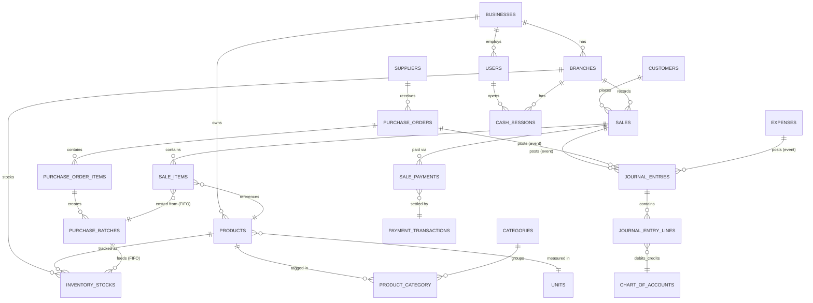

# 3. Database Schema

Conventions applied to **every** table unless noted otherwise:

- `id BIGINT UNSIGNED AUTO_INCREMENT PRIMARY KEY`
- `public_id CHAR(26)` — ULID, unique-indexed, used in URLs/API/receipts/QR codes instead of `id`
- `business_id BIGINT UNSIGNED NOT NULL` FK → `businesses.id`, part of a composite index on
  every tenant-scoped table (omitted only on the handful of truly global tables noted below)
- `created_at`, `updated_at` (`TIMESTAMP`)
- `deleted_at` (`TIMESTAMP NULL`) — soft deletes on master data and transactional records that
  must never hard-delete (products, customers, suppliers, sales, purchases); **not** used on
  pure log tables (`stock_movements`, `audit_logs`) which are append-only by design
- Money columns: `DECIMAL(14,2)` (never float). Quantity columns: `DECIMAL(12,3)` to support
  fractional weight (e.g. `0.250` kg).
- All FKs `ON DELETE RESTRICT` by default (explicit `CASCADE`/`SET NULL` called out where used)

## 3.1 Simplified Core ERD

## 3.2 Foundation Tables

### `businesses` (global — no `business_id` on itself)
| Column | Type | Notes |
|---|---|---|
| id, public_id | | |
| name | VARCHAR(150) | "Magar Masu Pasal Tatha Anya Tarkari" |
| legal_name | VARCHAR(150) | NULL |
| business_type_id | FK → business_types | drives default units/attributes/receipt template |
| pan_vat_number | VARCHAR(30) NULL | Nepal PAN/VAT registration |
| currency | CHAR(3) DEFAULT 'NPR' | |
| timezone | VARCHAR(50) DEFAULT 'Asia/Kathmandu' | |
| logo_media_id | FK → media (Spatie) NULL | |
| status | ENUM('active','suspended','trial') | |
| deleted_at | | |

### `business_types` (global, seeded reference data)
| Column | Type | Notes |
|---|---|---|
| id | | |
| key | VARCHAR(50) UNIQUE | `meat_shop`, `grocery`, `pharmacy`, `restaurant`, ... `custom` |
| name | VARCHAR(100) | |
| default_config | JSON | default unit set, default attribute set, default receipt sections |

### `branches`
| Column | Type | Notes |
|---|---|---|
| id, public_id, business_id | | |
| name | VARCHAR(100) | |
| address, phone | | |
| is_main | BOOLEAN | |
| status | ENUM('active','inactive') | |
| deleted_at | | |
Index: `(business_id, status)`

### `branch_terminals`
| Column | Type | Notes |
|---|---|---|
| id, public_id, business_id, branch_id | | |
| name | VARCHAR(50) | "Counter 1" |
| paired_display_token | VARCHAR(64) NULL | rotated on re-pair |
| last_seen_at | TIMESTAMP NULL | |

### `users`
| Column | Type | Notes |
|---|---|---|
| id, public_id, business_id | business_id NULL for future platform-admin users | |
| name, email, phone | email unique per business (`UNIQUE(business_id, email)`) | |
| password | HASHED | |
| two_factor_secret, two_factor_recovery_codes | TEXT NULL, encrypted cast | 2FA-ready |
| status | ENUM('active','suspended') | |
| last_login_at, last_login_ip | | |
| deleted_at | | |

### `user_branch` (pivot — staff assigned to one or more branches)
`user_id, branch_id, is_default`

Roles/permissions: standard Spatie Permission tables (`roles`, `permissions`,
`model_has_roles`, `model_has_permissions`, `role_has_permissions`), with `roles.business_id`
added (nullable = system role template, non-null = tenant-custom role) so each tenant can
define **Custom Roles** on top of the seeded Owner/Manager/Cashier/Accountant/Inventory
Manager/Admin set.

### `settings`
| Column | Type | Notes |
|---|---|---|
| id, business_id | | |
| key | VARCHAR(100) | e.g. `pos.default_discount_max_percent` |
| value | JSON | typed at the application layer |
Unique: `(business_id, key)`

### `product_attribute_definitions`
| Column | Type | Notes |
|---|---|---|
| id, business_id | | |
| business_type_id | FK NULL | shared default vs. tenant override |
| key, label | VARCHAR | `expiry_date`, `weight_unit`, `size`, `color` |
| data_type | ENUM('string','number','date','boolean','enum') | |
| options | JSON NULL | for `enum` type |
| is_required | BOOLEAN | |
| applies_to | ENUM('product','sale_item') | e.g. expiry captured per batch/sale line for meat |

### `audit_logs` (append-only, no soft delete)
| Column | Type | Notes |
|---|---|---|
| id, business_id | | |
| user_id | FK NULL (NULL = system) | |
| action | VARCHAR(100) | `product.updated`, `sale.refunded`, `permission.changed`, ... |
| auditable_type, auditable_id | polymorphic | |
| old_values, new_values | JSON NULL | |
| ip_address, user_agent | | |
| created_at | | no `updated_at` |
Index: `(business_id, auditable_type, auditable_id)`, `(business_id, created_at)`

## 3.3 Catalog & Inventory Tables

### `units`
`id, business_id NULL(=global default), name, symbol, base_unit_id NULL, conversion_factor DECIMAL(12,6) DEFAULT 1`
— e.g. `gram` has `base_unit_id = kg.id, conversion_factor = 0.001`.

### `categories`
`id, public_id, business_id, parent_id NULL (self-referencing), name, slug, sort_order, deleted_at`

### `product_category` (pivot, many-to-many): `product_id, category_id`

### `products`
| Column | Type | Notes |
|---|---|---|
| id, public_id, business_id | | |
| name, slug | | |
| sku | VARCHAR(64) NULL, `UNIQUE(business_id, sku)` | |
| barcode | VARCHAR(64) NULL, `UNIQUE(business_id, barcode)` | supports EAN/QR payload |
| unit_id | FK → units | |
| sell_by_weight | BOOLEAN | drives POS weight-entry UI |
| track_batches | BOOLEAN | drives FIFO batch flow |
| track_expiry | BOOLEAN | |
| cost_price, selling_price | DECIMAL(14,2) | current defaults; actual cost comes from batches |
| tax_rule_id | FK NULL | |
| min_stock, max_stock | DECIMAL(12,3) NULL | per-branch overrides in `product_branch_settings` |
| default_supplier_id | FK NULL | |
| image_media_id | FK → media NULL | Spatie Media Library handles the file |
| status | ENUM('active','inactive','discontinued') | |
| deleted_at | | |
Indexes: `(business_id, status)`, `(business_id, barcode)`, `(business_id, sku)`, fulltext on
`name` for search.

### `product_branch_settings` (per-branch stock thresholds/pricing override)
`id, business_id, branch_id, product_id, min_stock, max_stock, selling_price_override NULL`

### `product_attribute_values`
`id, business_id, product_id, attribute_definition_id, value` (stored as string, cast by
`data_type` from the definition)

### `suppliers`
`id, public_id, business_id, name, contact_person, phone, email, address, pan_vat_number, bank_details (encrypted), status, deleted_at`

### `purchase_orders`
`id, public_id, business_id, branch_id, supplier_id, reference_no, status ENUM('draft','ordered','partially_received','received','cancelled'), ordered_at, expected_at, notes, created_by (FK users), deleted_at`

### `purchase_order_items`
`id, business_id, purchase_order_id, product_id, ordered_qty, unit_cost, received_qty DEFAULT 0`

### `purchase_batches` (the FIFO cost-layer record, created on goods receipt)
| Column | Type | Notes |
|---|---|---|
| id, public_id, business_id, branch_id | | |
| product_id, purchase_order_item_id NULL | | |
| batch_number | VARCHAR(64) NULL | supplier's or auto-generated |
| quantity_received, quantity_remaining | DECIMAL(12,3) | remaining decreases as FIFO consumes it |
| unit_cost | DECIMAL(14,2) | this batch's cost basis |
| expiry_date | DATE NULL | |
| received_at | TIMESTAMP | |
Index: `(business_id, branch_id, product_id, received_at)` — FIFO consumption order.

### `inventory_stocks` (current on-hand summary, one row per branch+product)
`id, business_id, branch_id, product_id, quantity_on_hand DECIMAL(12,3), quantity_reserved DECIMAL(12,3) DEFAULT 0`
Unique: `(branch_id, product_id)`. This is a maintained aggregate; `stock_movements` is the
source of truth it's derived from.

### `stock_movements` (append-only ledger — every stock change, ever)
| Column | Type | Notes |
|---|---|---|
| id, business_id, branch_id, product_id | | |
| batch_id | FK → purchase_batches NULL | |
| type | ENUM('purchase_receipt','sale','sale_return','adjustment','spoilage','waste','damage','transfer_in','transfer_out') | |
| quantity_change | DECIMAL(12,3) | signed |
| reference_type, reference_id | polymorphic | points to the Sale/PurchaseOrder/StockAdjustment/StockTransfer that caused it |
| unit_cost_at_movement | DECIMAL(14,2) NULL | for valuation reporting |
| created_by | FK users | |
| created_at | | no update/delete — corrections are new offsetting rows |

### `stock_adjustments` / `stock_adjustment_items`
Header + lines capturing reason (`spoilage`, `waste`, `damage`, `recount`), approver, notes —
each line writes one `stock_movements` row.

### `stock_transfers` / `stock_transfer_items`
Branch-to-branch transfer header (`from_branch_id`, `to_branch_id`, `status`) + lines — writes
one `transfer_out` and one `transfer_in` movement per line on receipt confirmation.

## 3.4 Customer, Sales & POS Tables

### `customer_groups`
`id, business_id, name (e.g. "Retail","Credit","Restaurant/Table"), allow_credit BOOLEAN, credit_limit DECIMAL(14,2) NULL, default_discount_percent DECIMAL(5,2) DEFAULT 0`
— configurable, not hardcoded; a restaurant tenant can rename this "Table"/"Room Service" freely.

### `customers`
`id, public_id, business_id, customer_group_id, name, phone (UNIQUE per business), email NULL, address, current_due DECIMAL(14,2) DEFAULT 0, deleted_at`

### `held_bills` (POS "hold/resume")
`id, public_id, business_id, branch_id, terminal_id, cashier_id, cart_snapshot JSON, held_at`

### `sales`
| Column | Type | Notes |
|---|---|---|
| id, public_id, business_id, branch_id, terminal_id | | |
| customer_id | FK NULL (walk-in) | |
| cashier_id | FK users | |
| invoice_no | VARCHAR(30), `UNIQUE(business_id, invoice_no)` | sequential per branch, human-readable |
| subtotal, discount_amount, tax_amount, total_amount | DECIMAL(14,2) | |
| status | ENUM('completed','void','refunded','partially_refunded') | |
| sale_type | ENUM('retail','credit') | |
| notes | TEXT NULL | |
| completed_at | TIMESTAMP | |
| deleted_at | | soft delete only for void/GDPR-style corrections, never for real deletion of history |
Indexes: `(business_id, branch_id, completed_at)`, `(business_id, customer_id)`

### `sale_items`
| Column | Type | Notes |
|---|---|---|
| id, business_id, sale_id, product_id | | |
| batch_id | FK → purchase_batches NULL | FIFO cost trace |
| quantity | DECIMAL(12,3) | supports weight, e.g. `0.750` |
| unit_price, cost_price_at_sale, discount_amount, tax_amount, line_total | DECIMAL(14,2) | `cost_price_at_sale` captured for accurate profit reporting even if product cost changes later |

### `sale_returns` / `sale_return_items`
Header (`sale_id`, `reason`, `approved_by`, `refund_method`) + lines (`sale_item_id`, `quantity`, `refund_amount`) — writes offsetting `stock_movements` and a negative `payment_transactions`/journal entry.

### `payment_transactions`
| Column | Type | Notes |
|---|---|---|
| id, public_id, business_id | | |
| payable_type, payable_id | polymorphic (Sale, SaleReturn, SupplierPayment...) | |
| gateway_key | VARCHAR(30) | `cash`, `manual_qr`, `esewa`(future)... |
| amount, currency | | |
| status | ENUM('pending','authorized','captured','failed','cancelled','refunded') | |
| gateway_reference | VARCHAR(100) NULL | provider's transaction id, once real gateways exist |
| meta | JSON NULL | |
| processed_at | | |

### `sale_payments` (supports split/mixed payment on one sale)
`id, business_id, sale_id, payment_transaction_id, amount`

### `cash_sessions`
`id, business_id, branch_id, terminal_id, opened_by, opening_cash, closed_by NULL, closing_cash_expected NULL, closing_cash_counted NULL, variance NULL, status ENUM('open','closed'), opened_at, closed_at NULL`

### `cash_movements` (paid-in/paid-out during a session, outside of sales)
`id, business_id, cash_session_id, type ENUM('paid_in','paid_out'), amount, reason, created_by`

## 3.5 Accounting Tables

### `chart_of_accounts`
`id, business_id, code, name, type ENUM('asset','liability','equity','income','expense'), parent_id NULL, is_system BOOLEAN` (system accounts like "Cash", "Sales Revenue", "Inventory Asset", "COGS" seeded per tenant on creation; tenant can add sub-accounts)

### `journal_entries`
`id, public_id, business_id, branch_id NULL, reference_type, reference_id (polymorphic source: Sale, PurchaseOrder, Expense, manual), description, entry_date, created_by NULL(=system), status ENUM('posted','reversed')`

### `journal_entry_lines`
`id, business_id, journal_entry_id, account_id (FK chart_of_accounts), debit DECIMAL(14,2) DEFAULT 0, credit DECIMAL(14,2) DEFAULT 0`
Constraint enforced at the Service layer: `SUM(debit) = SUM(credit)` per `journal_entry_id`.

### `bank_accounts`
`id, business_id, name, bank_name, account_number (encrypted), opening_balance, chart_of_accounts_id`

### `bank_reconciliations` / `bank_reconciliation_items`
Header (`bank_account_id`, `statement_date`, `statement_closing_balance`) + matched
`journal_entry_line_id` references, `is_matched` flag.

### `expense_categories` / `expenses`
`expenses: id, public_id, business_id, branch_id, expense_category_id, amount, paid_via (cash/bank), vendor NULL, notes, expense_date, created_by, deleted_at` — fires `ExpenseRecorded` → Accounting posts the journal entry.

## 3.6 Notifications, Backups

### `notifications` — Laravel's standard polymorphic notifications table, `business_id` added
for tenant-scoped querying.

### `notification_preferences`
`id, business_id, user_id, channel ENUM('database','mail','sms'), type VARCHAR(100), enabled BOOLEAN`

### `backup_runs`
`id, business_id NULL(=platform-wide), type ENUM('scheduled','manual'), status, file_path, size_bytes, started_at, completed_at NULL, error NULL`

## 3.7 Reporting/Analytics Aggregate Tables (materialized by scheduled jobs, not hand-written)

`daily_sales_aggregates(business_id, branch_id, date, total_sales, total_tax, total_discount, transaction_count, gross_profit)`
`product_performance_aggregates(business_id, branch_id, product_id, date, quantity_sold, revenue, profit)`

These exist purely so heavy dashboard/report queries read a small pre-computed table instead of
scanning `sale_items` for "last 12 months" ranges — populated by a nightly job, not a
request-time query.

## 3.8 Indexing & Performance Notes

- Every tenant-scoped table: composite index starting with `business_id` (and `branch_id` where
  applicable) — this is the single most important rule for multi-tenant query performance and
  is enforced via a migration review checklist, not left to convention alone.
- `stock_movements` and `audit_logs` are the highest-write, highest-growth tables — partition
  candidates by `created_at` (monthly) once volume warrants it (noted in the roadmap as a
  Phase 7+ concern, not day-one).
- Foreign keys enforced at the DB level (`ON DELETE RESTRICT`/`SET NULL` as noted) — soft
  deletes on parents mean "restrict" rarely fires in practice, but it's a correctness backstop.
