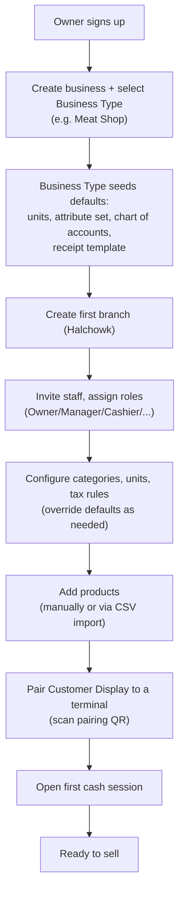
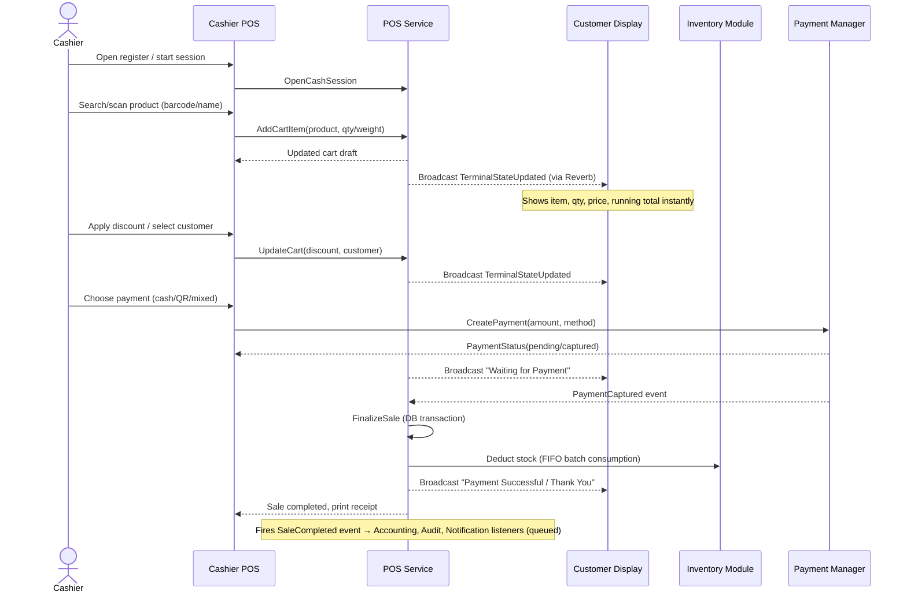
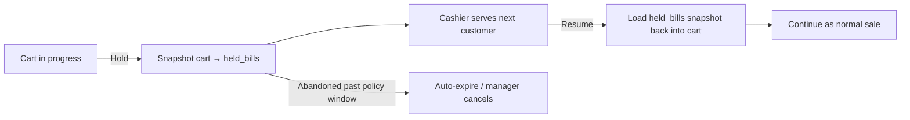
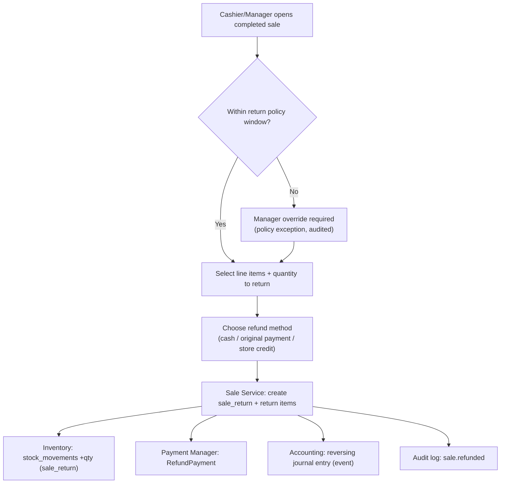
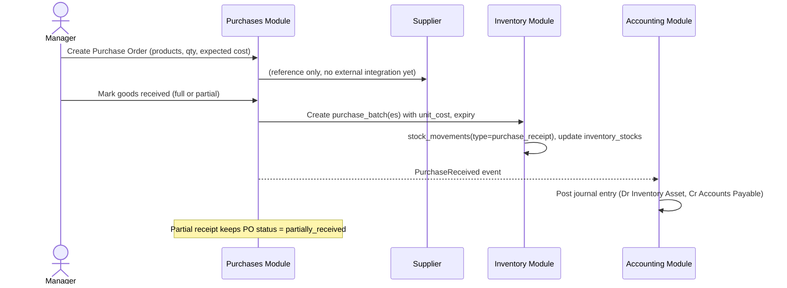
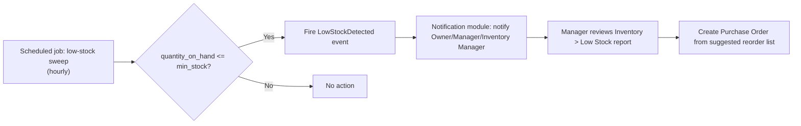
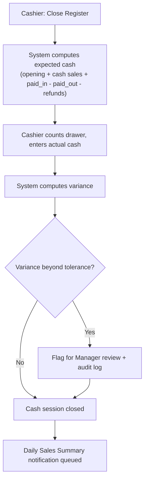
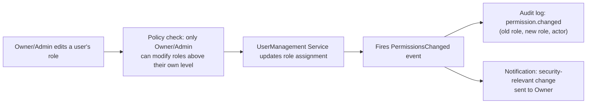

# 4. User Flow Diagrams

## 4.1 Tenant Onboarding

## 4.2 Cashier POS Sale (core loop)

## 4.3 Hold / Resume Bill

## 4.4 Return / Refund / Void

## 4.5 Purchasing → Inventory (Goods Receipt, FIFO batch creation)

## 4.6 Low Stock Alert → Reorder

## 4.7 Daily Cash Closing

## 4.8 Role/Permission Change (audited path)

